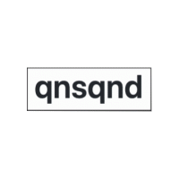

**qnsqnd** is a simple pub-sub broker over http. 


## Warning

Not recommended for using in **production** environment yet.


## Run Server

```
git clone https://github.com/sangwonl/qnsqnd.git
GIN_MODE=release go run cmd/app.go
```

## APIs

#### Subscribe
```
curl -X POST -d '{"topic": "mytopic", "filter": "F(\"hello\") == \"world\""}' localhost:8080/subscribe
{"subscriptionId":"b1486a6b-c264-4ac0-b3ca-8028f2cff127"}
```

#### Server Sent Event
```
curl -X GET -N -H "Accept:text/event-stream" localhost:8080/subscribe/b1486a6b-c264-4ac0-b3ca-8028f2cff127/sse
```

#### Publish
```
curl -X POST -d '{"topic":"mytopic", "payload": {"hello": "world"}}' localhost:8080/publish
```


## Benchmark

N/A


## Contributing

#### Pull Request

If you have any issue to contribute, please
- checkout a new branch (usually named as `issues/10-xxx`)
- make some commits and pull request to `master` as base branch


#### Load Test

Make subscribers by running `subscriber.go` first. You can give concurrency, duration, topic and filter expression.

```
go run test/loadtest/subscriber.go -concurrency 500 -duration 20 -host localhost:8080 -topic basic-topic -filter 'F("hello") == "world"'
```

And then make load to the host which subscribers connect to with `publish` operation. You might need [**k6**](https://k6.io/) to run load test scripts.

```
HOST=localhost:8080 TOPIC=basic-topic k6 run --vus 20 --duration 5s test/loadtest/publisher_basic.js
```
